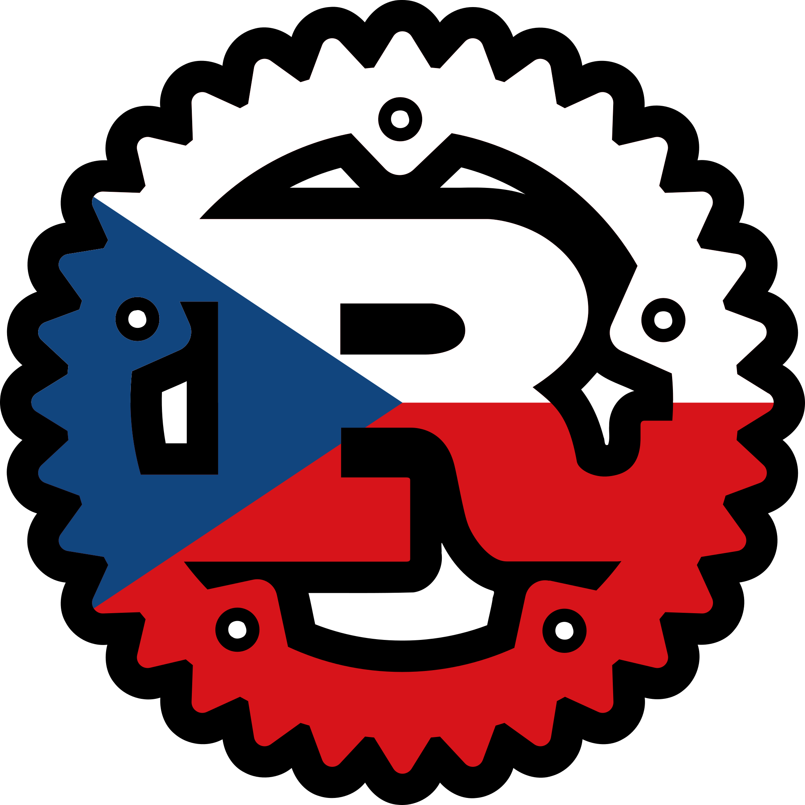

# rez



_Nejsi_ you tired from writing Rust programs in English? Do you like saying
_do prdele_ or _pivo_ a lot? Would you like to try something different, in an exotic and
funny-sounding language? Would you want to bring some Czech touch to your
programs?

**rez** (Czech for _Rust_) is here to save your day, as it allows you to
write Rust programs in Czech, using Czech keywords, Czech function names,
Czech idioms.

This has been designed to be used as the official programming language to
develop the future Czech sovereign operating system.

You don't feel at ease using only Czech words? Don't worry!
Czech Rust is fully compatible with English Rust, so you can mix both at your
convenience.

Here's an example of what can be achieved with rez:

## `vlastnost` a `implementuj` (a.k.a. `trait` and `impl`)

```rust
rez::rez! {
    používej standardní_knihovna::kolekce::Slovník jako Slovník;

    vlastnost KlíčHodnota {
        funkce vlož(&já, klíč: Řetězec, hodnota: Řetězec);
        funkce čti(&já, klíč: Řetězec) -> Výsledek<Možná<&Řetězec>, Řetězec>;
    }

    statický měnitelný SLOVNÍK: Možná<Slovník<Řetězec, Řetězec>> = Nic;

    // Slib mi, že toto nikdy nepoužiješ mimo hlavní vlákno!
    struktura GlobálníSlovník;

    implementuj KlíčHodnota pro GlobálníSlovník {
        funkce vlož(&já, klíč: Řetězec, hodnota: Řetězec) {
            ať slovník = nebezpečné {
                SLOVNÍK.dostaň_nebo_vlož_s(Výchozí::výchozí)
            };

            slovník.vlož(klíč, hodnota);
        }

        funkce čti(&já, klíč: Řetězec) -> Výsledek<Možná<&Řetězec>, Řetězec> {
            jestli je Nějaký(slovník) = nebezpečné { SLOVNÍK.jako_odkaz() } {
                VPořádku(slovník.dostaň(&klíč))
            } jinak {
                Špatné("Ověření slovníku".konvertuj())
            }
        }
    }
}
```

## Alternative syntax

```rust
#[povol(nedosažitelný_kód)]
funkce když_se_nepodaří() {
    panika!("Panika!");
    ups!("Něco se pokazilo");
}
```

## Other examples

See the [examples](examples/src/main.rs) to get a rough sense of the whole
syntax. It's that _snadné_.

## _Přispívání_

First of all, _moc děkuju_ for considering participating to this joke, the
Czech government will thank you later! Feel free to throw in a few identifiers
here and there, and open a pull-request against the `hlavni` (Czech for
`main`) branch.

In the Czech spirit, feel free to introduce swear words.

## But _proč_ would you do this?

* The glorious czech language can't fall behind the other languages
* _Pro zábavu_

## Other languages

Here's a non-exhaustive list of implementations for other languages:

* Romanian: [rugina](https://github.com/aionescu/rugina)
* French: [rouille](https://github.com/bnjbvr/rouille)
* Dutch: [roest](https://github.com/jeroenhd/roest)
* German: [rost](https://github.com/michidk/rost)
* Polish: [rdza](https://github.com/phaux/rdza)
* Italian: [ruggine](https://github.com/DamianX/ruggine)
* Russian: [ржавчина](https://github.com/FluxIndustries/rzhavchina)
* Esperanto: [rustteksto](https://github.com/dscottboggs/rustteksto)
* Hindi: [zung](https://github.com/rishit-khandelwal/zung)
* Hungarian: [rozsda](https://github.com/jozsefsallai/rozsda)
* Chinese: [xiu (锈)](https://github.com/lucifer1004/xiu)
* Spanish: [oxido](https://github.com/fdschonborn/oxido)
* Korean: [Nok (녹)](https://github.com/Alfex4936/nok)
* Finnish: [ruoste](https://github.com/vkoskiv/ruoste)
* Arabic: [sada](https://github.com/LAYGATOR/sada)
* Turkish: [pas](https://github.com/ekimb/pas)
* Vietnamese: [gỉ](https://github.com/Huy-Ngo/gir)
* Japanese: [sabi (錆)](https://github.com/yuk1ty/sabi)
* Danish: [rust?](https://github.com/LunaTheFoxgirl/rust-dk)
* Marathi: [gan̄ja](https://github.com/pranavgade20/ganja)

You can find a more comprehensive list on [@bnjbvr](https://github.com/bnjbvr)'s [rouille](https://github.com/bnjbvr/rouille#other-languages) repo.

## _Poděkování_

* [@bnjbvr](https://github.com/bnjbvr) for the idea, as well as the base repo
* [@aionescu](https://github.com/aionescu) for the exposure to this idea and inspiring me to do this

## Licence

[WTFPL](http://www.wtfpl.net/)
